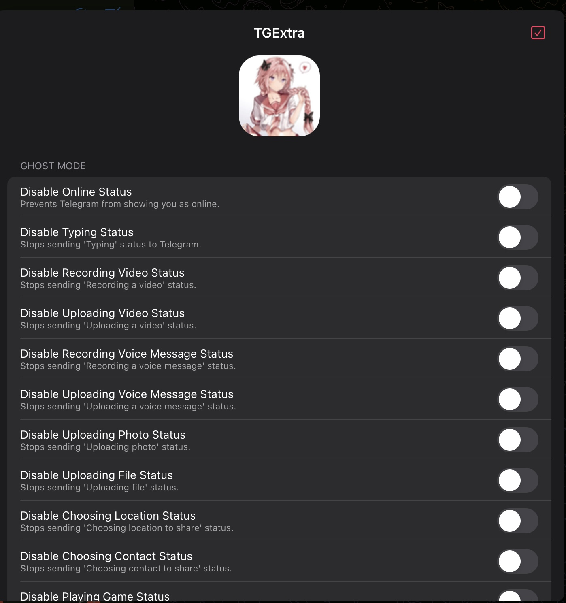
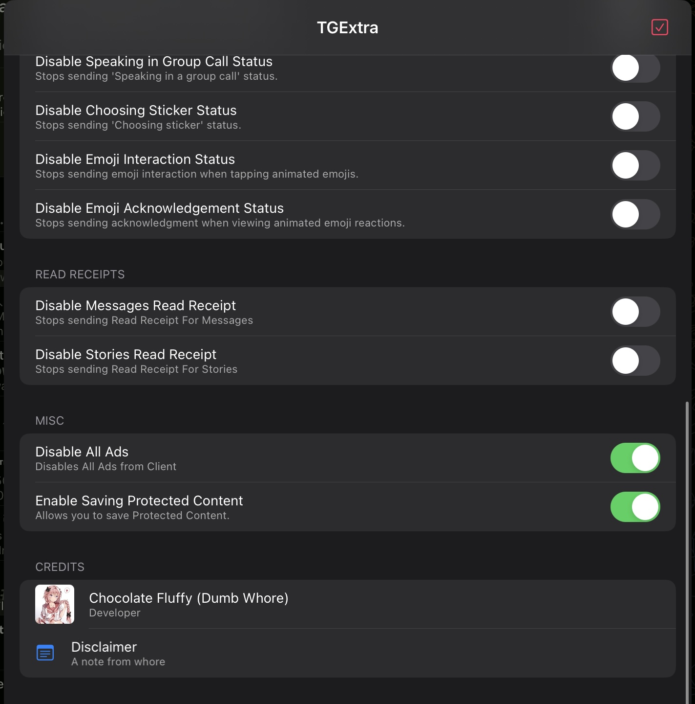

# TGExtra (but with PR's merged)
A simple Telegram iOS Tweak.

To Open Tweak menu : Longpress screen with 3 finger (if no flex injected) of 4 fingers.

## Screenshots




## Features

- Disable Ads
- Ghost Mode
- No Read Receipt for messages and Stories
- Allow saving Protected Content ( Due to frequenet Telegram Api updates this feature is only limited for client compiled with 11.8.1 sources)
- Show a bounded local indicator for messages captured before deletion

## Dopamine rootless build

This build configuration targets standard Dopamine rootless on `iphoneos-arm64`
and keeps the existing Swiftgram bundle filter (`app.swiftgram.ios`). It does
not target RootHide or sideloaded IPA injection.

With Theos and a legitimate Apple SDK installed, build it with:

The build also needs Theos' standard rootless headers/libroot integration,
the project’s Orion support, and an iPhoneOS SDK (the Makefile selects 16.5).

```sh
make clean package FINALPACKAGE=1 STRIP=0
```


## Disclaimer

This project is an **independent modification (tweak)** for the Telegram app. I am **not affiliated, associated, authorized, endorsed by, or in any way officially connected with Telegram Messenger LLP**, or any of its subsidiaries or affiliates.

This tweak is created solely for **personal and educational purposes**. Use it at your own risk.

**I do not take any responsibility for any issues, damages, or consequences** resulting from the use or misuse of this tweak. If something breaks, it's not my problem.
